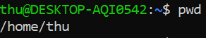
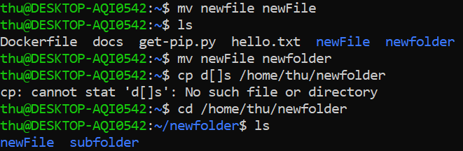

# Command Line

## 1. Shell

Shell là nơi để người dùng sử dụng các lệnh để thực hiện các thao tác với tệp, thư muc, ứng dụng...

>**echo**: in các đối số kiểu text ra màn hình.
>
>**date** đưa ra thời gian: thứ ngày tháng giờ, múi giờ, năm
>
>**whoami** trả về tên người dùng


## 2. Print working directory

- Mọi thứ trong Linux đều là một tệp và được tổ chức thành các thư mục phân cấp. Thư mục đầu tiên trong hệ thống là root, trong root sẽ chưa các thư mục và tệp, các thư mục này có thể chứa các thư mục và tệp con trong nó. Vị trí của tệp và thư mục là đường dẫn.

- **pwd**: in đường dẫn thư mục hiện tại, dùng để biết bạn đang ở đâu.



## 3. Change directory

- Có 2 cách để bạn di chuyển trong hệ thống tệp:

  - Sử dụng đường dẫn tuyệt đối: đường dẫn tuyệt đối bắt nguồn từ thư mục gốc (root), hiển thị bằng dấu **/** (slash). VD: /home/thu

  - Sử dụng đường dẫn tương đối: đường dẫn này bắt đầu từ thư mục mà bạn đang ở đó. VD: bạn đang ở /home/thu/docs và bạn muốn tới thư mục training trong docs thì bạn có thể sử dụng *training* (hoặc cũng có thể đường dẫn tuyệt đối)

- **cd**: thay đổi đường dẫn


- Một vài phím tắt với cd

  - *cd .* thư mục hiện tại

  - *cd ..* thư mục mẹ (thu mục phí trên thư mục hiện tại)

  - *cd -* thư mục trước đó mà bạn vừa ở

  - *cd ~* hoặc *cd* thư mục mặc định hoặc thư mục chính (VD: /home/thu)

  

## 4. List directory

- **ls**: Liệt kê các thư mục/tệp trong thư mục hiện tại, ngoài ra bạn cũng có thể chỉ định đường dẫn cho thư mục bạn muốn liệt kê

>ls không hiển thị các tệp bắt đầu bằng .


- Một số cờ với ls:

  - -a hiển thị tất cả

  - -l hiển thị danh sách chi tiết ở dạng dài: quyền với tệp, số lượn liên kết, tên chủ sở hữu, nhóm chủ sở hữu, kích thước, dấu thời gian lần cuối sửa, tên tệp

  - -R liệt kê đệ quy nội dung

  - -r đảo ngược thứ tự khi sắp xếp

  - -t sắp xếp theo thời gian sửa đối, mới nhất trước.


## 5. Touch

**touch**: tạo một tệp mới


>touch có thể làm thay đối dấu thời gian của tệp

## 6. File

**file** dùng để hiển thị mô tả về nội dung của tệp


## 7. Cat

**cat**: dùng để xem nội dung tệp


> có thể xem nhiều tệp cùng lúc bằng cách thêm tên tệp vào sau cat, các tên cách nhau bởi dấu cách.

## 8. Less

- **less** chế độ này có thể điều hướng trong file

VD: less hello.txt

- Một số command để điều hướng thông qua less

  - q: thoát khỏi less và quay lại shell

  - Page up, Page down, Up and Down: sử dụng các nút mũi tên trên bàn phím để điều hướng

  - g: tới đầu file

  - G: tới cuối file

  - /search: tìm kí tự/từ phí sau /

  - h: bảng hướng dẫn sử dụng trong less


## 9. History

**history** dùng để xem các lệnh đã thực hiện


>Có thể dùng nút PageUp trên bàn phím hoặc gõ *!!* để chạy lệnh ngay phía trên
>
>Sử dụng Ctrl+R để và gõ các kí tự để có được lệnh trong history mà chứa các từ đó.
>
>**clear** để xóa màn hình

## 10. Copy

- **cp** tạo bản sao của một tệp trong đường dẫn nào đó hoặc copy nội dung từ file này sang file khác


- wildcard

  - * đại diện cho các kí tự đơn hoặc bất kì chuỗi nào

  > VD ```cp * home/thu/newfolder``` sẽ copy tất cả các file trong thư mục hiện tại vào thư mục newfolder

  - ? đại diện cho một kí tự

  >VD cp ```cp doc? home/thu/newfolder``` sẽ copy tất cả các file có tên bắt đầu với "doc" trong thư mục hiện tại vào thư mục newfolder

- flag

  - -r dùng để copy đệ quy (copy tất cả file folder và những folder con bên trong những folder đó)

  - -i để cảnh báo việc ghi đè khi có file đã tồn tại trong thư mục đích

## 11. Move

- **mv** sử dụng để di chuyển tệp hoặc đổi tên chúng



- flag

  - -i để cảnh báo việc ghi đè

  - -b khi thư mục đích đã tồn tại file cùng tên thì cơ này giúp bạn di chuyển bằng cách thêm vào cuối tên file cần move một dấu ~

## 12. Make Directory

**mkdir** tạo thư mục mới


> có thể tạo nhiều thư mục cùng lúc
>
>Cờ -p cho phép tạo subdirectories. VD mkdir -p abc/de

## 13. Remove

- **rm**: xóa

> lệnh này sẽ xóa thẳng các tệp mà không có một "thùng rác" nào để bạn có thể remove nó. Ngoại trừ các loại tệp write-protected yêu cầu xác nhận trước khi xóa


- flag

  - -f xóa mà không quan tâm tới write-protected, miễn là có đủ quyền

  - -i nhắc nhở trước khi xóa

  - -r xóa thư mục

> rmdir directory: xóa dirrectory

## 14. Find

**find**: tìm kiếm tệp hoặc thư mục nào đó tại nơi được chỉ định


## 15. Help

**help** hỗ trợ cách sử dụng với một số lệnh và kiểm tra các flag có sẵn


## 16. Man

**man** hướng dẫn sử dụng một lệnh


## 17. Whatis

**whatis** mô tả ngắn gọn chức năng của một lệnh


## 18. Alias

**alias** Sử dụng để gán bí danh cho lệnh khi không muốn gõ đi gõ lại một lệnh dài


>Bí danh sẽ mất khi khởi động lại máy. Muốn tránh điều đó, cần lưu bí danh trong ~/.bashrc
>
> Xóa alias bằng lệnh unalias. VD ```unalias find```

## 19. Exit

**exit** thoát/đóng

**logout** đăng xuất

## References

<https://linuxjourney.com/lesson/the-shell>
