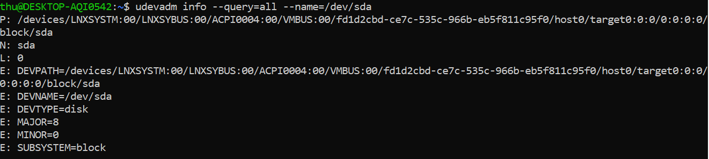
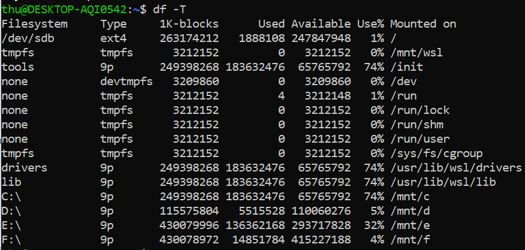

# Devices & Filesystem-hierarchy

## I. Device

### 1. Thư mục /dev

- Khi kết nối một thiết bị với máy của mình, cần có một trình điều khiển để hoạt động bình thường

- Có thể tương tác với trình điều khiển thiết bị thông qua device files hoặc devices nodes

- Các device files được lưu trong thư mục /dev

### 2. Device types

- Các thành phần từ trái sang phải

  - Quyền

  - Owner

  - Nhóm

  - Số thiết bị chính

  - Số thiết bị nhỏ

  - Dấu thời gian

  - Tên thiết bị

- Bit đầu tiên mỗi dòng là kiểu của file

  - c: character: các thiết bị truyền dữ liệu, nhưng mỗi lần 1 kí tự. Có rất nhiều pseudo devices (/dev/null) dưới dạng character device, các thiết bị này không thực sự được kết nối vật lí với máy, nhưng chúng cho phép hệ điều hành có nhiều chức năng hơn.

  - b: block: các thiết bị này truyền dữ liệu trong khối có kích thước cố định lớn. Các thiết bị thường sử dụng khối dữ liệu dưới dạng block device như harddrive, filesystem

  - p: pipe: cho phép nhiều tiến trình giao tiếp với nhau. Loại này tương tự như character device nhưng thay vì gửi output tới một thiết bị, nó gửi tơi một tiến trình.

  - s: socket: loại này tạo điều kiện giao tiếp giữa các tiến trình, tương tự như pipe device nhưng nó có thể giao tiếp với nhiều tiến trình cùng lúc.

- Đặc tính thiết bị: Các thiết bị được đặc trưng bởi 2 con số

  - Số thiết bị chính: đại diện cho trình điều khiển thiết bị được sử dụng, thường là con số chính cho sd block devices

  - Số thiết bị nhỏ: con số này nói với nhân biết nó là loại thiết bị duy nhất nào trong lớp điều khiển này

### 3. Device Name

- SCSI Devices (Small Computer System Interface)

  - Giao thức được sử dụng để cho phép giao tiếp giữa đĩa, máy in, máy quét và các thiết bị ngoại vi khác với hệ thống.

  - Hệ thống Linux tương ứng với đĩa SCSI với trình điều khiển ổ đĩa cứng trong /dev, chúng được thể hiện bằng tiền tố sd (SCSI disk)

    - /dev/sda: first hard disk

    - /dev/sdb: second hard disk

    - /dev/sda3: phân vùng thứ 3 trên đĩa cứng đầu tiên

- Pseudo Devices:

  - Không trực tiếp kết nối tới hệ thống

  - Thường là character device

  - Một số device

    - /dev/zero: chấp nhận và loại bỏ tất cả đầu vào, tạo ra một dòng liên tục các byte NULL (giá trị không)

    - /dev/null: chấp nhận và loại bỏ tất cả đầu vào, không tạo ra đầu ra

    - dev/random: tạo ra các số ngẫu nhiên

- Thiết bị PATA

  - Đôi khi trong hệ thống cũ hơn, ổ cứng được tham chiếu với tiền tố hd:

    - /dev/hda: đĩa cứng đầu tiên

    - /dev/hdd2: phân vùng thứ 2 trên đĩa cứng thứ 4

### 4. sysfs

- Dùng để quản lí các thiết bị trên hệ thống 

- Là một virtal filesystem, thường được gắn vào thư mục /sys, cung cấp các thông tin chi tiết hơn những gì có thể thấy trong /dev

- So với /dev: /sys được dùng để xem thông tin và quản lí device, còn /dev thì cho phép các chườn trình khác truy cập vào.

- Bao gồm tất cả thông tin cho tất cả các thiết bị: chẳng hạn như nhà sản xuất và kiểu máy, nơi thiết bị được cắm vào, trạng thái của thiết bị, thứ bậc và nhiều thông tin khác

### 5. udev

- Tự động xóa và tạo các device file tùy thuộc vào việc nó có được kết nối hay không

- udevd daemon: lắng nghe các thông báo từ hạt nhân về các thiết bị được kết nối với hệ thống. Trình nền này sẽ phân tích cú pháp thông tin và nó sẽ khớp dữ liệu với các quy tắc được chỉ định trong /etc/udev/rules.d. Dựa vào các quy tắc đó, nó có thể tạo các node device và liên kết tượng trưng cho các thiết bị

- Có thể dùng **udevadm** để xem thông tin thiết bị

### 6. lsusb, lspci, lssci

Giống như việc sử dụng ls để liệt kê các thư mục, các lệnh dưới đây dùng để liệt kê các thiết bị tương ứng:

- **lsusb** liệt kê các thiết bị usb

- **lspci** liệt kê các thiết bị pci

- **lsscsi** liệt kê các thiết bị scsi

### 7. dd

- **dd** đọc input từ file hoặc data stream và viết nó vào file hoặc data stream

## II. Filesystem-hierarchy

### 1. Filesystem hierarcy

- / Thư mục gốc của toàn bộ hệ thống tập tin, mọi thứ đều nằm trong thư mục này

- /bin: Các chương trình sẵn sàng chạy khi cần thiết, bao gồm những lệnh cơ bản nhất như ls và cp

- /boot: Chứa các tệp bộ nạp khởi động hạt nhân 

- /dev: Tệp thiết bị

- /etc: Thư mục cấu hình hệ thống cốt lõi, chỉ nên chứ các tệp cấu hình chứ không phải tệp nhị phân nào

- /home: Thư mục cá nhân cho người dùng. lưu trữ tài liệu, tệp, cài đặt của người dùng

- /lib: chưa thư viện mà các tệp nhị phân có thể sử dụng

- /proc: thông tin về các quy trình đang chạy hiện nay

- /tmp: bộ nhớ cho các tệp tạm thời

- /var: thư mục biến, nó được sử dụng để ghi nhật kí hệ thống, theo dõi người dùng, bộ nhớ đệm... về cơ bản à bất cứ thứ gì có thể thay đổi liên tục

### 2. Filesystem Type

- Journaling: Nếu có journaled system, trước khi thực hiện việc gì đó, nó sẽ viết những gì sẽ làm vào log file (journal). Khi việc đó được thực hiện và hoàn thành, journal sẽ đánh dấu là đã hoàn thành. Điều này giúp filesystem luôn nhất quán. Ngoài ra, nếu có sự cố xảy ra, nó sẽ biết công việc đó đang dừng tại đâu. Việc này cũng giúp giảm thời gian khởi động do thay vì kiểm tra toàn bộ filesystem, nó chỉ xem journal.

- Một số loại desktop filesystem phổ biến:

  - ext64

  - Btrfs

  - XFS

  - NTFS và FAT

  - HFS +

### 3. Anatomy of a Disk

- Đĩa cứng có thể được chia nhỏ thành các phân vùng, về cơ bản tạo thành nhiều block device. Việc phân vùng hữu ích để phân tách dữ liệu và nếu bạn cần một hệ thống tệp nhất định, bạn có thể dễ dàng tạo một phân vùng thay vì đặt toàn bộ đĩa thành một kiểu hệ thống tệp

- Partition table (bảng phân vùng): Mỗi đĩa có một bảng phân vùng, bảng này cho hệ thống biết cách phân vùng của đĩa, nơi bắt đầu và kết thúc của phân vùng, phân vùng nào có thể khởi động được, phân vùng nào được phân bổ cho phân vùng nào. Có 2 lược đồ phân vùng chính được sử dụng:

  - MBR

  - GPT
