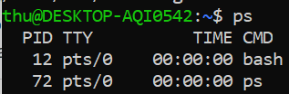
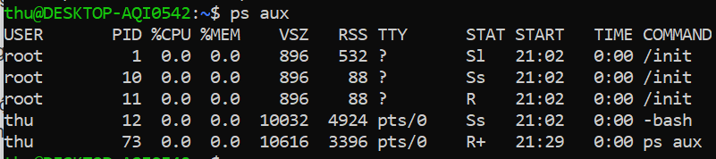
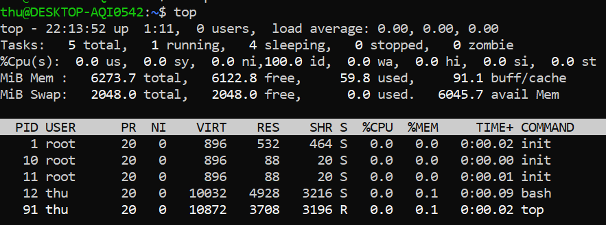
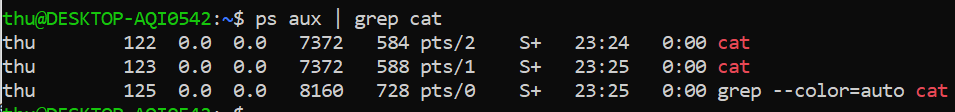
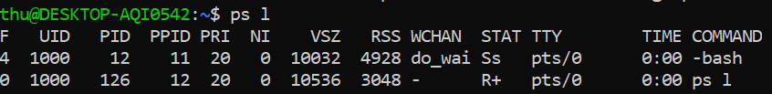
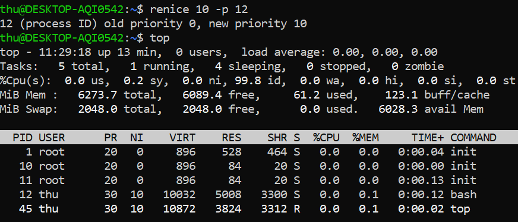

# Process & Package

## I. Process

### 1. ps (process)

- **ps** Tiến trình (process) là các chương trình đang chạy trên máy. Chúng được quản lí bởi hạt nhân và mỗi tiến trình có một ID riêng (PID)

  

- Các phần từ trái qua phải:

  - PID: ID quy trình

  - TTY: kiểm soát thiết bị đầu cuối liên quan đến quy trình

  - TIME: tổng thời gian sử dụng CPU

  - CMD: Tên của lệnh, lệnh thực thi

- Flag

  - **a** hiển thị tất cả các quá trình đang chạy , bao gồm cả những quá trình đang được chạy vởi những người dùng khác

  - **u** đưa ra chi tiết hơn về các tiến trình

  - **x** liệt kê tất cả các quy trình không có TTY liên kết với nó, các chương trình này sẽ thể hiện *?* ở trường TTY

  

- Ngoài ra, lệnh **top** cung cấp thông tin thời gian thực về các tiến trình đang chạy trên hệ thống. Đây là công cụ hữu ích để xem những quy trình nào đang chiếm

  

### 2. Process Details

- Kernel phụ trách các tiến trình, khi chúng ta chạy một chương trình, kernel sẽ tải mã của chương trình đó lên bộ nhớ, xác định và phân bổ tài nguyên, giữ các tab trên mỗi tiến trình. Nó biết:

  - Tình trạng của tiến trình

  - Các tài nguyên mà tiến trình nhận được và đang sử dụng

  - Chủ sở hữu của tiến trình

  - Xử lí tín hiệu

  - Mọi thứ cơ bản khác

- Khi một tiến trình kết thúc, tài nguyên nó sử dụng sẽ được giải phóng cho tiến trình khác.

- VD: Mở 3 terminal, ở 2 terminal, chạy lệnh ```cat``` nhưng ko có đối số. Ở cửa sổ còn lại, chạy lệnh ```ps aux | grep cat```. Bạn sẽ thấy 2 tiến trình cho lệnh **cat** mặc dù nó gọi tới cùng một chương trình.

  

### 3. Process Creation

- Khi một tiến trình mới được tạo, một tiến trình hiện có sẽ tự sao chép bằng cách sử dụng *fork system call*. Fork system call sẽ tạo một tiến trình con gần như giống hệt và nó có mã tiến trình mới (PID). Tiến trình gốc sẽ trở thành "tiến trình mẹ" của nó. Tiến trình con sẽ có mã tiến trình cha kí hiệu là PPID.

  

- Tiến trình con có thể tiếp tục sử dụng chương trình mà cha mẹ nó đã sử dụng trước đó hoặc thường xuyên sử dụng *execve system call* để khởi chạy một chương trình mới. Execve system call sẽ phá hủy việc quản lí bộ nhớ mà kernel đã dành cho nó và thiết lập các bộ nhớ mới cho chương trình mới.

- Tiến trình "mẹ" của tất cả các tiến trình: Khi hệ thống khởi động, kernel tạo ra một tiến trình gọi là **init** có PID là 1. Tiến trình này không thể kết thúc trừ khi hệt thống tắt và nó chạy với đặc quyền root.

### 4. Process Termination

- Một tiến trình có thể thoát bằng **_exit system call**, lệnh này sẽ giải phóng tài nguyên mà lệnh đó sử dụng để phân bổ lại.

- Termination status (Trạng thái kết thúc): điều này cho kernel biết lí do tại sao tiến trình kết thúc. Trạng thái phổ biến là 0 có nghĩa là quá trình đã thành công.

- Để kết thúc hoàn toàn một tiến trình, tiến trình mẹ phải xác nhận việc kết thúc tiến trình con bằng các sử dụng *wait system call* và điều này giúp nó kiểm tra trạng thái kết thúc của tiến trình con.

- Hai cách để kết thúc tiến trình:

  - Orphan Processes: Khi một tiến trình cha chết trước một tiến trình con, kernel biết rằng tiến trình sẽ không nhận được *wait system call*. Kernel sẽ biến các tiến trình này thành *orphan* và đặt nó dưới sự chăm sóc của **init**. **init** sẽ thực hiện *wait system call* và các tiến trình con đó có thể kết thúc.

  - Zombie Processes
  
    - Khi một tiến trình con kết thúc mà tiến trình mẹ vẫn chưa thực hiện *wait system call*, kernel sẽ biến tiến trình con thành *zombie process*. Các tài nguyên mà tiến trình con sử dụng vẫn được giải phóng, tuy nhiên vẫn có mục trong bảng tiến trình cho zombie này.

    - *Zombie process* không thể bị kết thúc vì thực ra nó đã kết thúc, nên không thể dùng signal để giết chúng.

    - Nếu tiến trình mẹ gọi *wait system call*, zombie sẽ biến mất. Nếu tiến trình mẹ không dùng *wait system call*, **init** sẽ "nhận nuôi" zombie, tự động gọi *wait system call* và loại bỏ zombie.

### 5. Signals

- Là một thông báo cho một tiến trình rằng điều gì đó đã xảy ra.

- Tại sao lại có tín hiệu:

  - Người dùng có thể dùng Ctrl+C hoặc Ctrl+Z để hủy, ngắt hoặc tạm ngừng các tiến trình.

  - Sự cố phần cứng phần mềm có thể xảy ra và kernel muốn thông báo tới tiến trình.

  - Chúng là cách các tiến trình có thẻ giao tiếp.

- Signal process: Khi một tín hiệu được tạo ra bởi một số sự kiện, nó sẽ được chuyển đến một tiến trình. Nó được coi ở trạng thái chờ cho tới khi được phân phối. Khi tiến trình được chạy, signal sẽ được phân phối. Tuy nhiên tiến trình có *signal masks* và chúng có thể làm việc phân phối tín hiệu có thể bị khóa nếu được chỉ định. Khi một signal được phân phối, tiến trình có thể làm một số viêc như:

  - Bỏ qua signal

  - Bắt signal và thực hiện một quy trình xử lí cụ thể

  - Tiến trình có thể được kết thúc, trái ngược với *exit system call* thông thường.

  - Chặn signal, dựa trên *signal mask*

- Một số tín hiệu phổ biến

  - SIGHUP hoặc HUP hoặc 1: Cúp máy: được gưi tới một tiến trình khi thiết bị điều khiển đầu cuối đóng. VD: nếu bạn đóng một cửa số đầu cuối có một quy trình đang chạy, bạn sẽ nhận được tín hiệu này, về cơ bản  là bị treo
  
  - SIGINT hoặc INT hoặc 2: Ngắt: Khi sử dụng Ctrl+C, hệ thống sẽ cố gắng kết thúc tiến trình một cách "duyên dáng"
  
  - SIGKILL hoặc KILL hoặc 9: Giết: giết quy trình mà không cho nó thực hiện bất kì hoạt động dọn dẹp nào (Đây là tín hiệu không thể chặn được)
  
  - SIGSEGV hoặc SEGV hoặc 11: Lỗi phân đoạn
  
  - SIGTERM hoặc TERM hoặc 15: Chấm dứt phần mềm: Hủy nhưng cho phép thực hiện một số hoạt động dọn dẹp trước
  
  - SIGSTOP hoặc STOP: Dừng lại, tạm dừng một quá trình

### 6. kill

- **kill PID** lệnh này sẽ gửi tín hiệu SIGTERM đến tiến trình có id là PID để yêu cầu chấm dứt, giải phóng sạch sẽ tài nguyên và lưu trạng thái của nó.

- Có thể chỉ định tín hiệu. VD ```kill -9 12``` lệnh này sẽ gửi tín hiệu SIGKILL đến tiến trình có PID là 12

### 7. niceness

- Các tiến trình sử dụng CPU một phần nhỏ thời gian gọi là *time slice*. Sau đó, chúng tạm thười dừng trong mili giây để tiến trình khác đẻ tiến trình khác nhận được *time slice*. Mọi tiến trình đều có đủ thời gian cho tới khi nó hoàn thành. Kernel xử lí tất cả các quá trình chuyển đổi này.

- **niceness** thể hiện mức độ ưu tiến của tiến trình với CPU. Một số cao có  nghĩa là tiến trình tốt và có mức độ ưu tiên thấp hơn đối với CPU. Một số thấp hoặc âm có nghĩa là quá trình không tốt lắm và nó muốn lấy nhiều CPU.

- Với lệnh **top**, bạn có thể thấy niceness của tiến trình trên cột NI

- **nice** lệnh này để thiết lập mức ưu tiên cho tiến trình mới.

- **renice** được dùng để thiết lập ưu tiên cho tiến trình đã tồn tại.



### 8. Process States

```ps aux```

Cột STAT biểu thị trạng thái của tiến trình:

- R: đang chạy hoặc có thể chạy được, nó chỉ chờ CPU xử lý thôi

- S: Ngủ gián đoạn, chờ một sự kiện hoàn thành, chẳng hạn như đầu vào từ thiết bị đầu cuối

- D: Ngủ liên tục, các tiến trình không thể bị giết hoặc bị gián đoạn bằng signal; thường để làm cho chúng biến mất thì phải khởi động lại hoặc khắc phục sự cố

- Z: Zombie - các tiến trình bị kết thúc đang chờ thu thập trạng thái của chúng

- T: Đã dừng, một quá trình đã bị tạm dừng / dừng

### 9. /proc filesystem

- Mọi thứ trong Linux đều là file, thậm chí là tiến trình. Thông tin tiến trình được lưu trong một filesystem đặc biệt là /proc

- VD

  - Xem các tiến trình

  

  - Xem chi tiết một tiến trình

  
