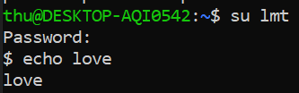
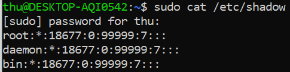
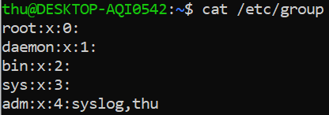
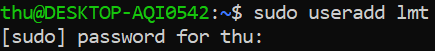
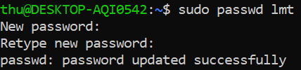
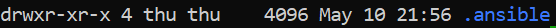
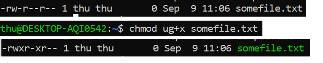
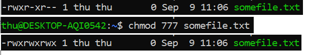

# User management & Permission

## I. User management

- Trong các hệ điều hành truyền thống, thường có user và group, chúng tồn tại cho truy nhập và cấp quyền.

- Mỗi user có một home directory để lưu trữ các file của họ (thường là /home/username)

- Hệ thống sử dụng user id (UID) để quản lí *user*. Ngoài ra, hệ thống cũng sử dụng *group* để cấp quyền, trong group sẽ có những user được cấp cùng các quyền. Hệ thống quản lí grooup qua group ID (GID)

- System daemon: là những *user* đặc biệt, liên tục chạy các tiến trình để giữ hệ thống hoạt động.

  - *root*: user mạnh nhất hệ thống, có đầy đủ quyền với bất kì tệp hay tiến trình nào. Việc sử dụng root rất nguy hiểm vì có thể ảnh hưởng tới các tệp quan trọng của hệ thống

  - *superuser*: lệnh sudo (superuser do) dùng để chạy lệnh với quyền truy cập root

### 1. root

```$ su```

- Lệnh này sẽ thay thế người dùng và mở root shell nếu như không có username nào được chỉ định. Có thể sử dụng lệnh này để thay thế bất kì người dùng nào miễn là bạn biết mật khẩu

  

- tệp /etc/sudoers liệt kê các user có thể dùng sudo, có thể chỉnh sửa tệp này bằng cách sử dụng lệnh **visudo**

### 2. /ets/passwd

- Để biết người dùng được ánh xạ tới ID nào, hãy xem tệp etc/passwd

  

- Các thành phần trong thông tin người dùng (từ trái sang phải, được ngăn cách bởi dấu hai chấm)

  - Username

  - Mật khẩu: Mật khẩu không thực sự được lưu trữ tại đây, nó thường được lưu tại /etc/shadow, ở đây, nó chưa mật khẩu nguồi dùng được mã hóa.

    - Dấu "x": là mật khẩu lưu tại /etc/shadow

    - Dấu "*": user không có quyền login

    - Khoảng trắng: user không có mật khẩu

  - UID: user ID

  - GID: group ID

  - Trường GECOS: trường này thường được sử dụng để để lại nhận xét về user hoặc tài khoản (như là tên thật hay sđt, được phân tách bằng dấu phẩy)

  - Home directory của user

  - Shell của user

### 3. /etc/shadow

- /etc/shadow dùng để lưu trữ thông tin xác thực người dùng. Nó yêu cầu quyền superuser.

    

- Các trường từ trái sang phải

  - username

  - Mật khẩu được mã hóa

  - Ngày thay đổi mật khẩu cuối cùng (lấy mốc từ ngày 1/1/1970)

  - Độ tuổi mật khẩu tối thiểu: Số ngày mà user sẽ phải đợi trước khi có thể thay đổi lại mật khẩu

  - Tuổi mật khẩu tối đa: Số ngày tối đa trước khi user phải thay đổi mật khẩu của họ.

  - Khoảng thời gian cảnh báo mật khẩu: Số ngày trước khi mật khẩu sắp hết hạn

  - Khoảng thời gian không hoạt động của mật khẩu: Số ngày sau khi mật khẩu hết hạn để cho phép đăng nhập bằng mật khẩu của họ.

  - Ngày hết hạn tài khoản: ngày mà user sẽ không thể đăng nhập

  - Trường dành để sử dụng trong tương lai

### 4. /etc/group

- lữu trữ thông tin các group với các quyền khác nhau

  

- Các trường (từ trái sang phải)

  - Tên group

  - mật khẩu group: không cần thiết đặt mật khẩu group, dấu * sẽ được đặt làm giá trị mặc định

  - GID

  - Danh sách user

### 5. User management tool

- Tạo user:

  

- Đổi mật khẩu cho người dùng:

  

- Xóa user:    ``` sudo userdel username ```

## II. Permission

### 1. File permission



Gồm 4 phần

- Phần đầu là loai tệp, thông thường sẽ là dấu **-**, ở đây là một folder nên là chữ **d**

- Ba phần tiếp theo là các quyền thực sự
  
  - Cấu trúc:

    - 3 bit đầu: quyền của user

    - 3 bit tiếp: quyền của group

    - 3 bit cuối: quyền khác

  - Phân loại bit kí tự:

    - r: read

    - w: write

    - x: execute

    - -: trống (không có quyền đó)

### 2. Modifying Permissions

**chmod** dùng để thay đối quyền với tệp.

- Cách 1: Cấu trúc sẽ là *chmod [ugo] [+-] [filename]*

  

- Cách 2: Sử dụng các số để cáp quyền, trường hợp này sẽ không cân chọn đối tượng, mà mỗi số sẽ tương ứng với 1 đối tượng.

  Trong mỗi nhóm đối tượng có 3 bit quyền, coi rằng 0 là không có quyền, 1 là có quyền. Vậy các số nhị phân từ 000 -111 sẽ biểu diễn được hết các trường hợp cấp quyền cho một đối tượng. Sau đó, ta đôi số nhị phân đó về dạng thập phân, như vậy sẽ nhận được số đại diện cho các quyền của một đối tượng

  

### 3. Ownership Permissions

- Đổi quyền sở hữu của user

  ```sudo chown user filename```

- Đổi quyền sở hữu nhóm

  ```sudo chgrp group filename```

- Đổi quyền cho user và group cùng lúc

  ```sudo chown user : group filename```

### 4. Umask

**umask** khi một tệp được tạo, nó đều đi kèm với các quyền mặc định, umask có thể thay đổi các quyền này, nhưng thay vì thêm, nó sẽ lấy đi các quyền

  VD: ```umask 021``` lệnh này sẽ ko (0) lấy đi quyền gì của user nhưng lấy đi quyền write (2) của group và lấy quyền execute(1) của other.

### 5. Setuid

- Set User Id (SUID) cho phép người dùng chạy chương trình với tư cách chủ sở hữu của tệp đó chứ ko phải chính họ.

- Cách sửa đổi SUID

  - sudo chmod u+s filename

  - sudo chmod 4755 filename 

### 6. Setgid

- Set Group Id (SUID) cho phép người dùng chạy chương trình với tư cách một thành viên của nhóm 

- Cách sửa đổi GUID

  - sudo chmod g+s myfile

  - sudo chmod 2555 myfile

## References

<https://linuxjourney.com/lesson/users-and-groups>

<https://linuxjourney.com/lesson/file-permissions>
