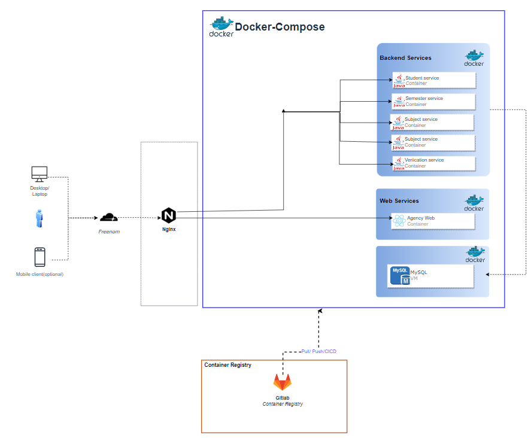
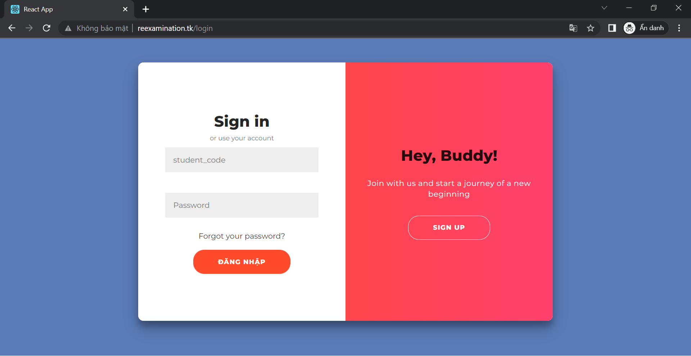

# Devops onboarding test

## Chuẩn bị

- Một máy chủ linux (cụ thể trong bài này sử dụng 1 vm chạy ubuntu)

- Source code: https://gitlab.com/soa-ptit

## Mô hình



## Tiến hành

### 1. Cài gitlab-runner

- Build container

```code
docker run -d --name gitlab-runner --restart always \
  -v /srv/gitlab-runner/config:/etc/gitlab-runner \
  -v /var/run/docker.sock:/var/run/docker.sock \
  gitlab/gitlab-runner:latest
```

- Register runner:

```
docker run --rm -it -v /srv/gitlab-runner/config:/etc/gitlab-runner gitlab/gitlab-runner register
```

- Đăng kí theo hướng dẫn

  - Gitlab url

  - Token

  - Tên

  - Tags: các job có tag này sẽ được chạy bởi runner, có thể để trống

  - Image: chọn image cho executor

  - Defaut image: nếu chọn image Docker thì cần nhập default image cho executor

- Cấu hình executor: đối với cách triển khai gitlan-runner bằng docker và chọn executor docker, cần chỉnh sửa cấu hình executor

  ```
  docker exec -it gitlab-runner bash
  nano /etc/gitlab-runner/config.toml
  ```

  Cấu hình thêm volume cho executor: **"/var/run/docker.sock:/var/run/docker.sock"**

### 2. Dockerfile

- source code

### 3. CICD

- .gitlab-ci.yml tại source code

- Cấu hình biến mối trường

  - USER: user trên server

  - SERVER: ip server

  - PATH_TO_PROJECT: đường dẫn đến thư mục chứ file docker-compose

  - SERVICE_NAME: tên service trong file docker-compose.yaml

  - SSH_PRIVATE_KEY

    Cách sinh key pair để ssh vào Server

    - ```ssh-keygen -t rsa```

    - Chọn file để lưu private key (VD: ~/.ssh/id_rsa.pub)

    - Enter để bỏ qua passphrase

    - ```cat ~/.ssh/id_rsa.pub >>  ~/.ssh/authorized_keys"```

    - Sử dụng giá trị trong  ~/.ssh/id_rsa làm giá trị cho SSH_PRIVATE_KEY

- docker-compose.yaml

```
version: '3.3'
services:
  mysql:
    image: mysql:8
    container_name: mysql
    restart: always
    ports:
      - 3309:3306
    volumes:
      - ./dump:/docker-entrypoint-initdb.d
    environment:
      - MYSQL_ROOT_PASSWORD=1
      - MYSQL_PASSWORD=1
      - MYSQL_USER=soa
      - MYSQL_DATABASE=soa
    networks:
      - soa

  registry-service:
    image: registry.gitlab.com/soa-ptit/registry-service:latest
    container_name: registry-service
    restart: always
    ports:
      - 8761:8761
    networks:
      - soa

  student-service:
    image: registry.gitlab.com/soa-ptit/student-service:latest
    container_name: student-service
    restart: always
    environment:
      - BASE_SERVER_IP=192.168.56.127
    ports:
      - 8080:8080
    networks:
      - soa

  semester-service:
    image: registry.gitlab.com/soa-ptit/semester-service:latest
    container_name: semester-service
    restart: always
    environment:
      - BASE_SERVER_IP=192.168.56.127
    ports:
      - 8081:8081
    networks:
      - soa

  subject-service:
    image: registry.gitlab.com/soa-ptit/subject-service:latest
    container_name: subject-service
    restart: always
    environment:
      - BASE_SERVER_IP=192.168.56.127
    ports:
      - 8082:8082
    networks:
      - soa

  verification-service:
    image: registry.gitlab.com/soa-ptit/verification-service:latest
    container_name: verification-service
    restart: always
    environment:
      - BASE_SERVER_IP=192.168.56.127
    ports:
      - 8083:8083
    networks:
      - soa

  reexamination-service:
    image: registry.gitlab.com/soa-ptit/reexamination-service:latest
    container_name: reexamination-service
    restart: always
    environment:
      - BASE_SERVER_IP=192.168.56.127
    ports:
      - 8084:8084
    networks:
      - soa

  frontend:
    image: registry.gitlab.com/soa-ptit/frontend:latest
    container_name: frontend
    restart: always
    ports:
      - 3000:80
    networks:
      - soa

networks:
  soa:
    external: true
```

Khi push code mới, gitlab sẽ thực hiện quá trình CICD

### 4. Gateway

- Sử dụng nginx

- Cài đặt:

  - ```sudo apt-get install nginx```

  - ```cd /etc/nginx/sites-available```

  - ```sudo nano default```

    Nội dung file default

    ```code
    upstream student {
      server 192.168.56.127:8080;
    }
    upstream semester {
      server 192.168.56.127:8081;
    }
    upstream subject {
      server 192.168.56.127:8082;
    }
    upstream verification {
      server 192.168.56.127:8083;
    }
    upstream reexamination {
      server 192.168.56.127:8084;
    }
    upstream frontend {
      server 192.168.56.127:3000;
    }

    server {
      listen 80;
      server_name reexamination.tk;

      location / {
            proxy_pass http://frontend;
      }
      location /api/v1/students {
            proxy_pass http://student;
      }
      location /api/v1/semesters {
            proxy_pass http://semester;
      }
      location /api/v1/subjects {
            proxy_pass http://subject;
      }
      location /api/v1/verifications {
            proxy_pass http://verification;
      }
      location /api/v1/reexaminations {
            proxy_pass http://reexamination;
      }
    }
    ```

    > 192.168.56.127  -> ip server

    > 192.168.56.127:xxxx -> địa chỉ các service backend/frontend sau khi deploy docker

    > reexamination.tk -> domain name

    > location -> định nghĩa api nào sẽ được forward tới server nào trên upstream.

  - ```service nginx reload```

